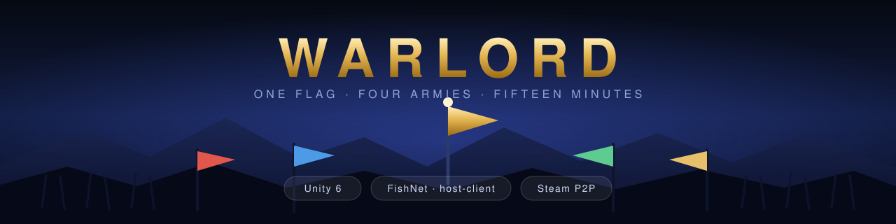
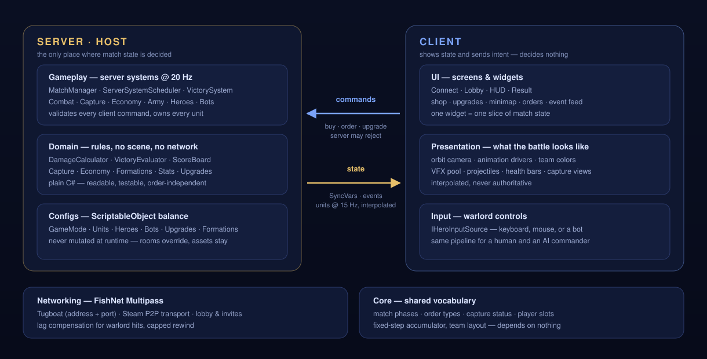

<p align="center">
  
</p>

<p align="center">
  <b>A third-person warlord. A squad that obeys orders. One flag everybody wants.</b><br>
  Multiplayer arena built in Unity 6 with an authoritative host, FishNet netcode and Steam lobbies.
</p>

<p align="center">
  
  
  
  
  
</p>

<p align="center">
  <a href="#-the-game">The game</a> &nbsp;·&nbsp;
  <a href="#-controls">Controls</a> &nbsp;·&nbsp;
  <a href="#-getting-started">Getting started</a> &nbsp;·&nbsp;
  <a href="#-architecture">Architecture</a> &nbsp;·&nbsp;
  <a href="#-repository-map">Repository map</a> &nbsp;·&nbsp;
  <a href="CONTRIBUTING.md">Contributing</a> &nbsp;·&nbsp;
  <a href="README.ru.md">🇷🇺 Русская версия</a>
</p>

---

## 🏰 The game

You play a **warlord** — a third-person melee hero — and at the same time you command **the army you bought**.
The match is decided by a central flag: hold it longer than anyone else and you win. Everything else on the
map exists to make holding it harder.

| Pillar | How it plays |
|---|---|
| **Hero + army in one pair of hands** | You fight in melee yourself and hand your squad one of four orders — *hold ground, follow me, attack move, defend* — while you do it. |
| **The flag is the clock** | Time on the central flag is the score. Tiebreaks fall through flag captures → bases captured → unit kills. |
| **Outposts change the map** | Every captured outpost grants one upgrade of your choice: *supply* (income and garrison slots), *forge* (faster builds, healing) or *mercenaries* (a new unit in your shop). |
| **Bases are a win condition too** | Capture an enemy base and that player is eliminated — and their gold walks home with you. |
| **Economy under fire** | Gold ticks passively, faster per flag and per captured base; XP buys a five-branch upgrade tree. |
| **Bots that are actually players** | Five personalities × four difficulty tiers, with an explicit vision model — a bot only knows what it can see. |

<table>
<tr><td><b>Players</b></td><td>2–4, host-client (the host plays)</td>
    <td><b>Match length</b></td><td>15 minutes by default</td></tr>
<tr><td><b>Army cap</b></td><td>20 units, single build queue</td>
    <td><b>Starting gold</b></td><td>300 &nbsp;·&nbsp; +8/s base income</td></tr>
<tr><td><b>Combat tick</b></td><td>20 Hz, server-authoritative</td>
    <td><b>Unit replication</b></td><td>15 Hz, interpolated on clients</td></tr>
<tr><td><b>Roster</b></td><td>swordsman · spearman · archer · mage · legionary · garrison guard</td>
    <td><b>Formations</b></td><td>line · wedge · square</td></tr>
</table>

### The loop

1. **Lobby** — pick a slot, fill the rest with bots, choose difficulty and personality.
2. **Countdown** — spawn at your base, buy your first units in the buy zone.
3. **Push** — take the central flag, grab outposts on the way, spend XP on upgrades.
4. **Pressure** — raid an enemy base to eliminate a rival, or defend yours while your army holds the line.
5. **Result** — longest flag hold wins; the tiebreak chain settles the rest.

## 🎮 Controls

| Input | Action |
|---|---|
| `W` `A` `S` `D` | Move · `Shift` sprint · `Space` jump |
| **Right mouse** | Attack |
| **Left mouse** | Send the order to the point under the cursor |
| `1` `2` `3` `4` | Hold ground · Follow me · Attack move · Defend |
| `Z` `X` `C` | Square · Wedge · Line formation |
| `Tab` | Upgrade tree |
| `B` | Army presets |
| `G` | Garrison shop (on a point you own) |
| `Left Alt` *(hold)* | Release the cursor to click the HUD without turning the camera |

> **Defend** is not just "stand still": while the shield is up, hits into the frontal arc are absorbed —
> flanks and backs still take full damage. Orders have counters, which is the point.

## 🚀 Getting started

**Requirements**

- **Unity 6000.4.3f1** (open the project with the exact version — [Unity Hub](https://unity.com/download) will offer to install it)
- **Git LFS** — one archive in `Assets/ModularRPGHeroesPolyArt/` is stored via LFS
- Windows is the developed-against platform; the Steam assembly also targets macOS and Linux standalone

```bash
git lfs install
git clone https://github.com/AdiletJienaliev/O1.git
cd O1
```

Open the folder in Unity Hub, then load `Assets/_InternalAssets/Scenes/Battle_Arena4.unity` — that is the
playable arena and the only scene in build settings.

**Running a match**

| Goal | What to do |
|---|---|
| Solo test, fastest path | In `Configs/GameFlowConfig.asset` set `skipLobby` — the host starts itself, no connect screen, no lobby |
| Local multiplayer | `backend = Localhost`, host on `127.0.0.1:7770`, join from a second Editor or build |
| Steam lobbies & invites | `backend = Steam` (or `Auto`) — needs the Steamworks packages below; `steam_appid.txt` is `480` (Spacewar), the standard test app id |

> [!IMPORTANT]
> `Packages/manifest.json` resolves **Heathen Steamworks Complete** from a local path
> (`file:C:/HeaSteamworks/...`). On a fresh clone that path will not exist, so either install the package
> to the same location, repoint the dependency at your own copy, or drop that line and stay on the
> `Localhost` backend — the game is fully playable without Steam.

**Driving the Editor from a terminal** — `Tools/agent/unity.sh` talks to an already-open Unity Editor:
status, screenshots, play/stop, console logs, UI clicks. See [`Tools/agent/README.md`](Tools/agent/README.md).

## 🧱 Architecture

The rule the whole codebase is built around: **the server decides, the client shows.** A client sends
intent, the server validates it against the rules and replicates the result — there is no path where a
client changes match state on its own.

<p align="center">
  
</p>

| Layer | Namespace | What lives there |
|---|---|---|
| **Core** | `Warlord.Core` | Enums shared by everyone, fixed-step accumulator, player slots, team layout. Depends on nothing. |
| **Domain** | `Warlord.Domain` | The rules as plain C#: damage resolution, capture state, economy, victory evaluation, formations. |
| **Configs** | `Warlord.Configs` | ScriptableObject balance — modes, units, heroes, bots, upgrades. Never mutated at runtime. |
| **Gameplay** | `Warlord.Gameplay` | The authoritative simulation: FishNet behaviours and server systems on a 20 Hz tick. |
| **Networking** | `Warlord.Networking` | FishNet Multipass bootstrap, lobby, Steam transport and session, lag compensation. |
| **Presentation** | `Warlord.Presentation` | Views, VFX pooling, projectiles, animation drivers, orbit camera, team colours. |
| **UI** | `Warlord.UI` | Connect / Lobby / HUD / Result screens and the widgets that render one slice of state each. |
| **Editor** | `Warlord.EditorTools` | Editor tooling, UI builders and the Agent Bridge. |

Assemblies: `Warlord.Runtime`, `Warlord.Steam` (standalone + editor only), `Warlord.Editor`,
`Warlord.Steam.Editor`. Dependency injection via **Zenject**, inspectors via **Odin**.

<details>
<summary><b>Design notes worth knowing before you read the code</b></summary>

- **Damage is queued, not instant.** Two units that kill each other on the same tick both die.
- **Nothing is predicted except your own hero.** Units are interpolated with a 0.1 s delay; hero hits are
  validated with lag compensation capped at 200 ms of rewind.
- **`MatchManager.Instance` is the only static in the project.** Networked prefabs cannot be injected any
  other way; everything else resolves through `IMatchContext`.
- **Bot vision is modelled explicitly.** The server sees everything, so "not knowing" has to be built:
  `Honest` (own units only), `Shared` (allies too), `Omniscient` (an opt-in handicap for the top tier).
- **Enum order is load-bearing.** Anything synced as a `byte` — match phase, orders, upgrades, slots — must
  keep its declaration order.
- Code comments are in Russian and reference the GDD by section (`ГДД §N`).

</details>

## 📁 Repository map

```
O1/
├─ Assets/
│  ├─ _InternalAssets/          # everything authored for this game
│  │  ├─ Art/                   #   materials, shaders, post-processing, UI art
│  │  ├─ Code/Warlord/          #   gameplay code — see Architecture above
│  │  ├─ Configs/               #   ScriptableObject balance assets
│  │  ├─ Prefabs/               #   units, heroes, UI, effects
│  │  └─ Scenes/                #   Battle_Arena4 — the playable arena
│  ├─ _ExternalAssets/          # third-party art, FX and animation packs
│  ├─ FishNet/                  # netcode library
│  ├─ Plugins/                  # Odin Inspector, Zenject
│  └─ Settings/                 # URP render pipeline assets
├─ Packages/                    # UPM manifest
├─ ProjectSettings/             # Unity project settings
├─ Tools/agent/                 # CLI bridge into a live Unity Editor
└─ .github/                     # issue & PR templates
```

## 🧭 Status & roadmap

Version `0.1.0` — playable end to end: lobby, bots, full match loop, victory screen.

- [x] Authoritative match loop, capture points, outposts, economy and upgrades
- [x] Bots with personalities, difficulty tiers and an honest vision model
- [x] Steam lobbies, invites and P2P transport
- [ ] Host migration — leaving the host currently ends the match
- [ ] Type-vs-type damage matrix (implemented, disabled by default)
- [ ] More arenas beyond `Battle_Arena4`

## 🤝 Contributing

Issues and pull requests are welcome — start with [CONTRIBUTING.md](CONTRIBUTING.md) for the commit,
review and Unity-specific conventions (scene merging, `.meta` files, config assets).

## 📜 Assets & rights

The gameplay code in `Assets/_InternalAssets/Code/` is the work of this project. Everything under
`Assets/_ExternalAssets/`, `Assets/Plugins/`, `Assets/FishNet/` and the other vendor folders is
**third-party content under its own licence** — Unity Asset Store packages, Odin Inspector, Zenject,
FishNet, Steamworks. Nothing here grants you a licence to redistribute those; buy or obtain them from
their original source before using them in your own project.

<p align="center"><sub>Built with Unity 6 · FishNet · Steamworks</sub></p>
